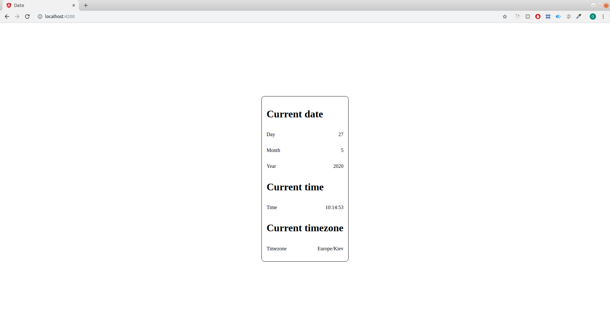

# Date API

The main goal of the task is to build an application that request data from external public service, process it in the RxJS pipe line and show data to the user.

Data in the application will simple data-time information. To get the information you will need to use [that](http://worldtimeapi.org/api/ip) api.

You have to use routing to display the component to the user as default route.

Expected result is the following:

